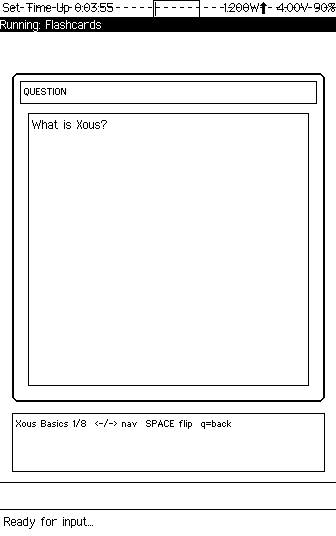
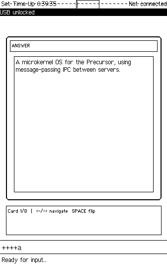
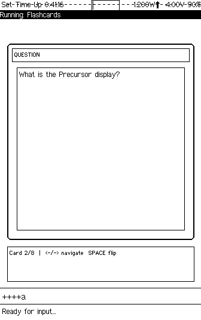

# Precursor Flashcards

A flashcard viewer app for the [Precursor](https://www.crowdsupply.com/sutajio-kosagi/precursor) hardware platform running [Xous OS](https://github.com/betrusted-io/xous-core).

## Screenshots

| Question | Answer | Navigation |
|----------|--------|------------|
|  |  |  |

*Running on Renode emulator (headless, screenshots captured via telnet monitor)*

## Features

- 8 built-in flashcards about the Xous/Precursor platform
- Flip between question and answer with Space/Enter
- Navigate between cards with arrow keys or n/p
- Clean bordered card layout with header indicating QUESTION/ANSWER
- Status bar shows card position (e.g., "Card 1/8")
- Proper focus management (pauses when backgrounded)

## Controls

| Key | Action |
|-----|--------|
| Space / Enter | Flip card (question/answer) |
| Right arrow / `n` | Next card |
| Left arrow / `p` | Previous card |

## Integration with xous-core

This app is designed to be placed in the `apps/` directory of the [xous-core](https://github.com/betrusted-io/xous-core) repository.

### Steps

1. Copy the app directory:
   ```bash
   cp -r precursor-flashcards/ xous-core/apps/flashcards/
   ```

2. Add to workspace `Cargo.toml` members list:
   ```toml
   members = [
       # ... existing members ...
       "apps/flashcards",
   ]
   ```

3. Add to `apps/manifest.json`:
   ```json
   "flashcards": {
       "context_name": "Flashcards",
       "menu_name": {
           "appmenu.flashcards": {
               "en": "Flashcards",
               "en-tts": "Flashcards"
           }
       }
   }
   ```

4. Build the Renode image:
   ```bash
   cargo xtask renode-image flashcards
   ```

## Architecture

The app follows standard Xous patterns:

- **GAM registration**: Registers as `UxType::Chat` with `LayoutBehavior::App`
- **Raw keys**: Receives keyboard input via `rawkeys_id` scalar messages
- **GamObjectList**: Uses batched draw calls for atomic screen updates
- **Focus handling**: Stops redrawing when backgrounded
- **Server pattern**: Uses `main() -> !` with `xous::terminate_process(0)` exit

## Toolchain Requirements

- Rust stable (tested with 1.88.0)
- Custom Xous sysroot for `riscv32imac-unknown-xous-elf`
- See [xous-dev-toolkit](https://github.com/user/xous-dev-toolkit) for complete setup instructions

## Development

This app was developed using the methodology described in [xous-dev-toolkit](https://github.com/user/xous-dev-toolkit) — an LLM-assisted approach to Precursor app development on macOS ARM64 where the Renode GUI is unavailable.

## License

Licensed under the same terms as xous-core (Apache-2.0/MIT).
