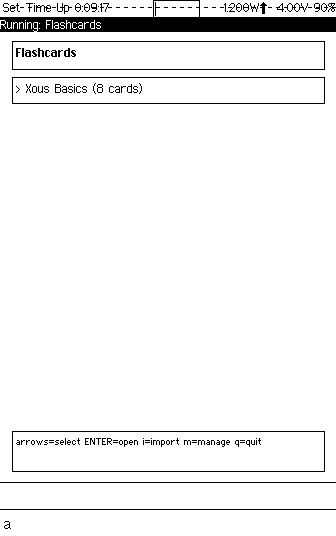
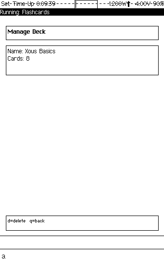
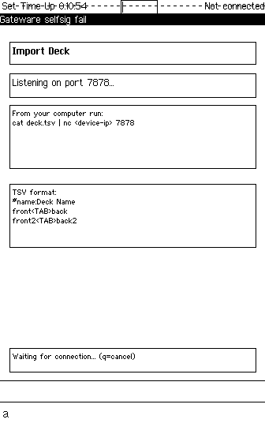

# Precursor Flashcards

**Private learning on sovereign hardware.**

```
"The things you learn most deeply are the things
you had to fight to understand — alone, in private,
at three in the morning, with no one watching."

— Every student who ever lived
```

---

## What This Is

Precursor Flashcards is a spaced repetition study tool that runs on [Precursor](https://precursor.dev) — bunnie Huang's open-source, auditable secure computing handheld. You create decks of cards, review them one at a time, flip between question and answer, shuffle, and move on. It stores everything in the PDDB — Xous's encrypted, plausibly deniable database. Your study material never leaves the device unless you explicitly export it.

The app supports multiple decks with up to 500 cards each, network import from any computer on your LAN, network export for backup, and a keyboard-driven interface that keeps your hands on the device and your attention on the material. There are no accounts. No sync servers. No analytics. No ads between cards. Just you and the thing you are trying to learn.

---

## Why This Project

Flashcards are ancient technology. The Leitner system dates to 1972. Piotr Wozniak formalized spaced repetition in 1985. The core insight is older than any of them: human memory strengthens through retrieval, not re-reading. You learn by testing yourself, failing, and testing again. The flash card — a question on one side, an answer on the other — is the minimal tool for this process.

The modern flashcard ecosystem has forgotten this simplicity. Anki is powerful but lives on your laptop, syncing decks through cloud services. Quizlet monetizes your study habits. Brainscape profiles your "confidence ratings" on their servers. Every major flashcard app treats your learning data as a product — something to analyze, optimize, and sell back to you as a premium feature.

Your study data is intimate. Your vocabulary lists reveal what language you are learning and why. Your medical terminology cards reveal what you are studying to become. Your bar exam prep reveals your career trajectory. Your security certification flashcards reveal what systems you are responsible for protecting. None of this should live on someone else's server. None of this should be one data breach away from public.

Spaced repetition works because it respects how memory actually functions. The tool should respect how privacy actually functions — by keeping your data physically under your control, encrypted at rest, on hardware you can audit.

---

## Why Precursor

Precursor is a handheld computer built on the premise that trust requires transparency — open-source hardware, open-source firmware, a RISC-V CPU you can inspect, and an operating system that communicates entirely through message passing with no shared memory between processes.

The PDDB (Plausibly Deniable DataBase) means your flashcard decks are encrypted at rest using keys derived from your PIN. Without the correct PIN, the data is not merely locked — it is indistinguishable from random noise. Your bar exam prep, your medical terminology, your language study — all of it is plausibly deniable. The storage system was designed for journalists and activists. It works just as well for students.

The 336x536 monochrome display and physical keyboard create a deliberately constrained study environment. There are no push notifications. No color-coded gamification. No "streak" counters manipulating you into opening the app for the wrong reasons. You open flashcards because you want to learn something. You close it when you are done. The constraint is the feature.

The keyboard-driven interface means review is tactile. Space to flip. Arrows to navigate. No swiping, no tapping glass. Your fingers know where the keys are. You can review cards without looking at where to tap — your eyes stay on the content.

---

## How It Works

### Features

- Multiple decks with persistent storage via PDDB
- Built-in demo deck on first launch
- **Import** decks from a computer over the network (TCP port 7878)
- **Export** decks back to a computer (TCP port 7879)
- Flip between question and answer with Space/Enter
- Navigate between cards with arrow keys or n/p
- **Shuffle** deck order for randomized review (Fisher-Yates algorithm)
- Deck management with delete support
- Scrollable deck list for large collections
- Up to 500 cards per deck
- Duplicate deck name handling on import

### Controls

#### Universal Keys

| Key | Action |
|-----|--------|
| F1 | Menu / Help |
| F4 | Exit / Back |
| F2 | Flip Card (in review) |
| F3 | Next Card (in review) |

#### Deck List

| Key | Action |
|-----|--------|
| Up/Down arrows or `j`/`k` | Move cursor |
| Enter | Open selected deck |
| `i` | Import a new deck |
| `m` | Manage selected deck |
| `q` | Quit app |

#### Card Review

| Key | Action |
|-----|--------|
| Space / Enter | Flip card (question/answer) |
| Right arrow / `n` | Next card |
| Left arrow / `p` | Previous card |
| `s` | Shuffle deck |
| `q` | Return to deck list |

#### Deck Menu

| Key | Action |
|-----|--------|
| `e` | Export deck (TCP) |
| `d` | Delete deck |
| `y` / `n` | Confirm/cancel deletion |
| `q` | Return to deck list |

### Loading Your Own Cards

The app uses a TCP push mechanism so you don't have to type URLs on the tiny Precursor keyboard. You author a simple TSV (tab-separated) file on your computer and push it to the device over the network.

**1. Create a deck file**

Create a `.tsv` file with a `#name:` header and tab-separated front/back pairs:

```
#name:Spanish Vocab
hola	hello
gato	cat
perro	dog
casa	house
libro	book
```

- First column = front of card (question)
- Second column = back of card (answer)
- Lines starting with `#` (other than `#name:`) are comments and ignored
- Empty lines are skipped
- Maximum 500 cards per deck

**2. Start the import listener**

On the Precursor, press `i` from the deck list screen. The device will show "Listening on port 7878..." and wait for a connection.

**3. Send the file from your computer**

```bash
cat my_deck.tsv | nc <device-ip> 7878
```

Replace `<device-ip>` with your Precursor's IP address (visible in the network settings).

The deck will be parsed, saved to the PDDB, and appear in your deck list immediately.

**Tips:**

- If you omit the `#name:` header, the deck will be auto-named "Imported 1", "Imported 2", etc.
- If a deck with the same name already exists, a suffix like "(2)" is added
- Maximum import size is 64KB per transfer
- The listener accepts one connection then returns to the deck list

### Exporting Decks

You can export any deck back to your computer using TCP. This allows backup and transfer of decks between devices.

**1. Start the export listener**

On the Precursor, go to the deck menu (press `m` on the deck list) and press `e` for export. The device will listen on port 7879.

**2. Receive the file on your computer**

```bash
nc <device-ip> 7879 > my_deck.tsv
```

The exported file uses the same TSV format as import, with the `#name:` header preserved.

### Example Deck Files

**Programming trivia:**
```
#name:Programming
What year was C created?	1972
Who created Python?	Guido van Rossum
What does HTML stand for?	HyperText Markup Language
```

**Study flashcards:**
```
#name:Biology 101
What is the powerhouse of the cell?	Mitochondria
What is DNA's sugar?	Deoxyribose
How many chromosomes do humans have?	46
```

---

## Technical Architecture

```
apps/flashcards/
├── Cargo.toml       # Dependencies: xous, gam, pddb, ticktimer
└── src/
    ├── main.rs      # App state machine, key handling, main loop
    ├── deck.rs      # Card/DeckMeta structs, binary serialization
    ├── storage.rs   # PDDB operations (list, load, save, delete)
    ├── import.rs    # TSV parser, TCP import/export
    └── ui.rs        # Screen drawing functions
```

### Design Decisions

**State machine**: The app moves through four states — `DeckList`, `CardReview`, `DeckMenu`, and `ImportWait` — with key dispatch routed by current state. Each state owns its own rendering and input handling, keeping the main loop clean.

**PDDB storage**: All decks live in the `flashcards` dictionary. An index key tracks deck metadata (names and card counts). Each deck's cards are stored as binary-serialized data in a separate key. This avoids parsing overhead on the constrained CPU — cards load as raw bytes and deserialize only when needed.

**GAM registration**: Registers as `UxType::Chat` for canvas access with raw keyboard input via `rawkeys_id` scalar messages. Focus changes gate all rendering — the app does zero work when backgrounded.

**TCP import/export**: Uses `std::net::TcpListener`, which Xous routes through its net service automatically. No networking crate dependencies required. The listener accepts a single connection, reads the TSV payload, parses it, and saves to PDDB. Export reverses the process on a separate port.

**Fisher-Yates shuffle**: When you press `s` during review, the deck order is randomized in-place using a proper Fisher-Yates shuffle. The shuffled order is ephemeral — it resets when you re-open the deck. Your saved card order is never modified.

---

## Building

Precursor Flashcards is a Xous app. It builds as part of the [xous-core](https://github.com/betrusted-io/xous-core) workspace.

### Integration

1. Copy the app directory:
   ```bash
   cp -r precursor-flashcards/ xous-core/apps/flashcards/
   ```

2. Add to workspace `Cargo.toml`:
   ```toml
   members = [
       # ... existing members ...
       "apps/flashcards",
   ]
   ```

3. Add to `apps/manifest.json`:
   ```json
   "flashcards": {
       "context_name": "Flashcards",
       "menu_name": {
           "appmenu.flashcards": {
               "en": "Flashcards",
               "en-tts": "Flashcards"
           }
       }
   }
   ```

4. Build for Renode emulator:
   ```bash
   cargo xtask renode-image flashcards
   ```

5. Build for hardware:
   ```bash
   cargo xtask app-image flashcards
   ```

### Toolchain Requirements

- Rust stable (tested with 1.88.0)
- Custom Xous sysroot for `riscv32imac-unknown-xous-elf`
- See [xous-dev-toolkit](https://github.com/tbcolby/xous-dev-toolkit) for complete setup instructions

---

## Screenshots

*Captured via headless Renode emulation on macOS ARM64. The Precursor display is 336x536 pixels, 1-bit monochrome.*

### Your Deck Library

Your decks, encrypted at rest in the PDDB. The demo deck ships with the app. Everything else you import yourself — from your computer, over your network, on your terms.



### Review Mode

One card at a time. No distractions. No sidebar of "related cards." No algorithm deciding what you should study next. Just the question, the screen, and your memory.


### Flip to Check

Space to flip. Were you right? Be honest — no one is watching. No one is scoring. The only person your answer matters to is you.


### Deck Management

Export to back up. Delete when you have learned it. Or keep it forever — the PDDB does not judge.



### TCP Import

Send cards from any device on your network. Author your deck in a text editor, pipe it through netcat, and it lands in encrypted storage. No app store. No account. No cloud.



---

## Changelog

### v0.2.0

- **Shuffle** -- Randomize card order with 's' key or menu option (Fisher-Yates algorithm)
- **Export** -- Send decks back to computer via TCP (port 7879)
- **Fixed quit** -- 'q' and F4 now properly exit the app from deck list
- **Fixed cursor** -- Cursor position correctly adjusted after deleting a deck

### v0.1.0

- Initial release with import, multi-deck support, and PDDB storage

---

## Development
---

This app was developed using the methodology described in [xous-dev-toolkit](https://github.com/tbcolby/xous-dev-toolkit) — an LLM-assisted approach to Precursor app development on macOS ARM64.

## Author
---

Made by Tyler Colby — [Colby's Data Movers, LLC](https://colbysdatamovers.com)

Contact: [tyler@colbysdatamovers.com](mailto:tyler@colbysdatamovers.com) | [GitHub Issues](https://github.com/tbcolby/precursor-flashcards/issues)

## License
---

Licensed under the Apache License, Version 2.0.

See [LICENSE](LICENSE) for the full text.
